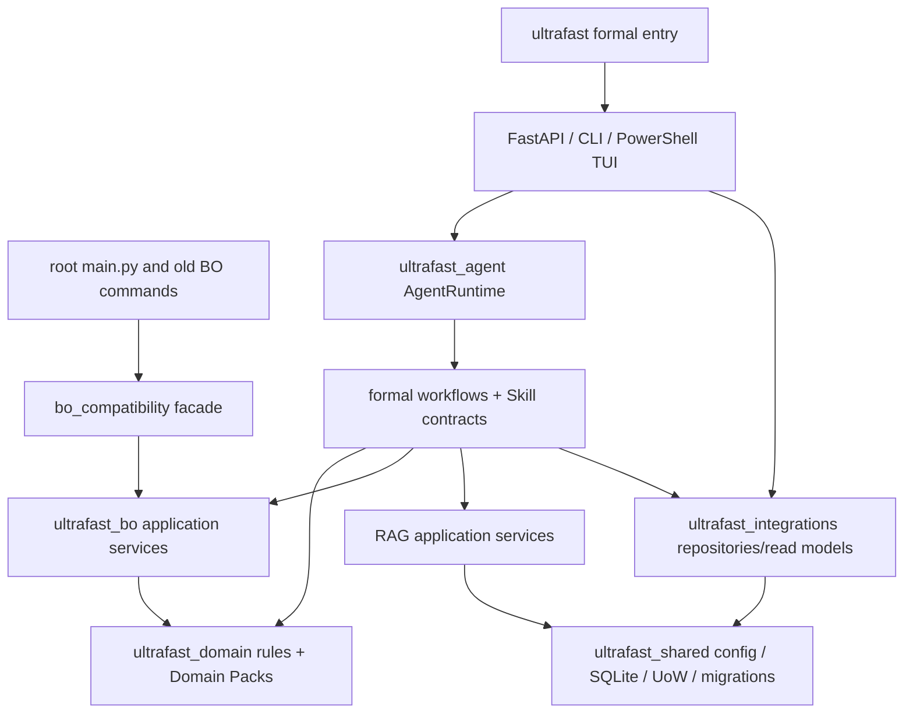

# Implemented dependency graph

## Enforced directions

- Apps call application/runtime services; API routers contain no SQL or core decision rules.
- Domain modules import neither FastAPI, PowerShell, Chat, RAG/BO infrastructure nor storage adapters.
- BO imports neither Chat nor RAG.
- Skills declare allowed tools; direct SQLite/raw-SQL Skill tools are forbidden.
- Infrastructure adapters implement persistence and read models; atomic review/trial/report writes use UnitOfWork.
- The old BO entry calls the new BO application service through a tested compatibility facade.

Architecture tests parse imports and router source to enforce these constraints. `ultrafast_memory.app.api` is a five-line compatibility module pointing to the split app.
