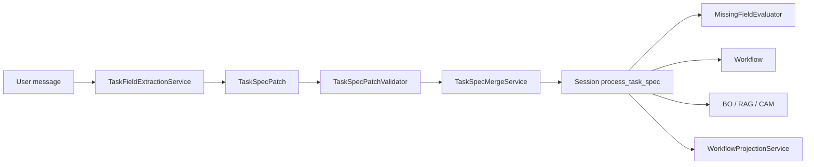
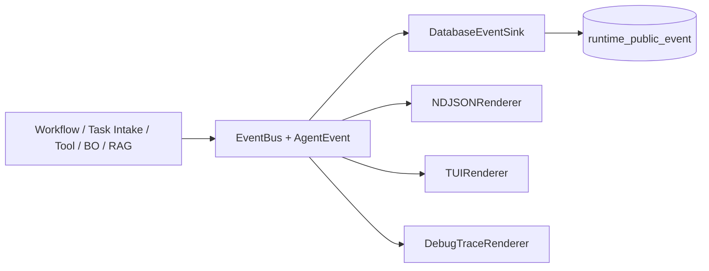
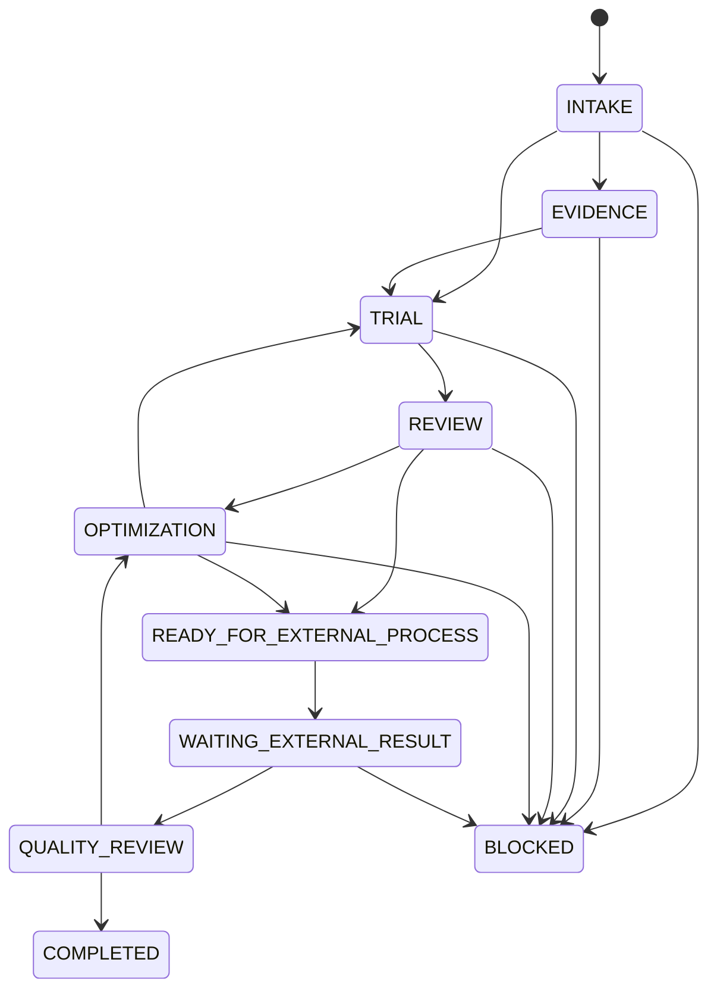

# Single Source of Truth Architecture

This document records the runtime architecture after the simplification migration that started from `cf3ad80`.

## Governing rules

- `TaskSpec`, `BusinessState`, `ProcessRecommendation`, and `AgentEvent` each have one canonical model.
- LLMs interpret natural language; deterministic code validates schemas, units, merges, boundaries, and transitions.
- Legacy entry points adapt into a canonical path. They never run a parallel business implementation.
- Safety complexity remains: dataset isolation, equipment hard bounds, knowledge review, provenance, and versioning.

## TaskSpec data flow

`workflow_status.py` never reads a user message. Older non-process chat enters through `LegacyTaskSpecAdapter`, which merges once into the session `task_spec`; projection then reads that document.

## AgentEvent data flow

SQLite is the canonical durable sequence allocator. `run_id` defines one event stream; `EventBus`
sequence values are provisional until `DatabaseEventSink` atomically allocates and inserts the durable
sequence. Allocation uses `BEGIN IMMEDIATE`, `runtime_event_sequence`, and a unique
`(stream_id, sequence)` constraint in the same transaction. A unique
`(stream_id, idempotency_key)` constraint makes retries return the original canonical event.
`render_sequence` is presentation order and is not an event sequence. The historical tables
`agent_trace_event`, `reasoning_status_trace`, and `public_reasoning_trace` remain in migrations for
old data compatibility but receive no new writes.

## Business State and substatus

Execution steps such as `rag_evidence_retrieval` and `bo_recommendation` remain Runtime steps. They are not business states.

| Canonical Business State | Compatible substatus values |
|---|---|
| `INTAKE` | `CREATED`, `INTAKE`, `REQUIREMENTS_PENDING`, `PARSER_STALL`, `REQUIREMENTS_CONFIRMED` |
| `EVIDENCE` | `EQUIPMENT_LOADING`, `EVIDENCE_RETRIEVAL`, `EVIDENCE_ASSESSMENT` |
| `TRIAL` | `TRIAL_ASSESSMENT`, `TRIAL_MODE_PENDING`, `TRIAL_PLAN_READY`, `TRIAL_EXECUTION_PENDING`, `TRIAL_RESULT_PENDING` |
| `REVIEW` | `TRIAL_RESULT_EVALUATION`, `KNOWLEDGE_APPROVAL_PENDING`, `PARAMETER_SOURCE_APPROVAL_PENDING` |
| `OPTIMIZATION` | `BO_READY`, `BO_RUNNING`, `REWORK_PENDING` |
| `READY_FOR_EXTERNAL_PROCESS` | `FORMAL_PROCESS_READY`, `FORMAL_RELEASE_PENDING`, `FORMAL_PREFLIGHT` |
| `WAITING_EXTERNAL_RESULT` | `FORMAL_PROCESS_RUNNING` |
| `QUALITY_REVIEW` | `FINAL_INSPECTION_PENDING`, `QUALITY_DECISION`, `REPORT_PENDING`, `ARCHIVE_PENDING` |
| `COMPLETED` | `COMPLETED` |
| `BLOCKED` | `BLOCKED`, `FAILED` |

`FORMAL_PROCESS_RUNNING` is a compatibility substatus meaning that the user reported external processing in progress. The system does not connect to, control, or monitor equipment.

## Projection boundary

`WorkflowProjectionService` is pure and accepts only formal TaskSpec, Business State, recent AgentEvents, and an optional equipment snapshot. It may calculate display percentages and summaries. It cannot parse language, transition business state, create canonical events, or call BO/RAG/OCR/CAM.

## Legacy adapters retained

- `LegacyTaskSpecAdapter`: old non-process chat message to canonical session `task_spec`.
- `LegacyWorkflowProjectionAdapter`: old chat response/progress persistence around the pure projection.
- `ultrafast_memory.agent_runtime.trace_collector`: old trace API to canonical `AgentEventService`.
- `ProcessStateMachine`: read-compatible fine-state adapter; `BusinessState` is authoritative.
- `normalize_stream_event`: old function name backed by `NDJSONRenderer`.

## Evolution scope

Only `bo_model` and `bo_acquisition_strategy` are formally enabled for promotion. Router, skill, prompt, RAG strategy, workflow policy, process-prior candidate, and validated-rule candidate schemas are reserved/experimental until they have a complete candidate generator, evaluation dataset, promotion metric, and rollback signal.
