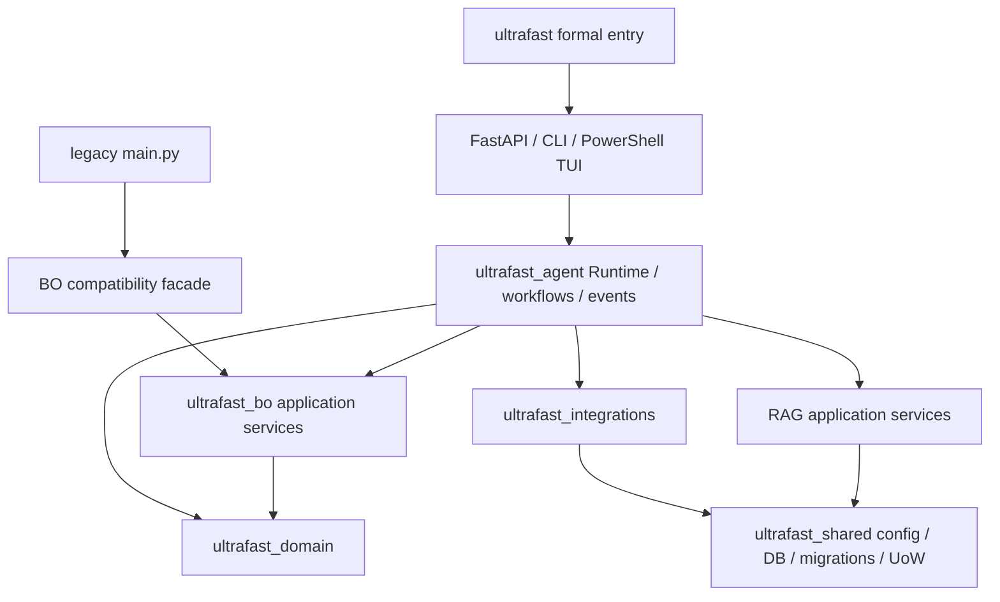

# Implemented target architecture

The repository is a modular monolith with one formal command, stable legacy adapters, transport routers, application/runtime orchestration, transport-independent domain rules, and infrastructure adapters.

## Implemented package responsibilities

| Package | Responsibility |
|---|---|
| `ultrafast_agent` | Workflow runner, tool registry, timeout/retry/cancellation, Skill contracts, public event bus, NDJSON normalization, formal workflows |
| `ultrafast_domain` | Task/equipment/process/evidence models, trial policy, review classification/gate, CRL/TGV/film-cooling/cover-glass/surface-texturing domain packs |
| `ultrafast_bo` | Dataset validation, mode selection, GPR modeling, cold-start/hybrid/data-driven recommendation, feedback, compatibility adapters |
| `ultrafast_integrations` | Read models, trial/review/runtime/demo repositories |
| `ultrafast_shared` | Layered configuration, SQLite session, UnitOfWork, ordered idempotent migrations |
| `ultrafast_memory.apps.api` | Thin FastAPI routers for chat, equipment, literature, RAG, knowledge, trial, BO, workflows, reports, and health |

`ultrafast_memory.app.api` remains a five-line compatibility import; endpoint paths and response contracts are preserved.

## Dependency rules

- Domain packages do not import FastAPI, SQLAlchemy, storage adapters, PowerShell, Chat, or RAG/BO infrastructure.
- BO does not import Chat or RAG.
- API routers do not contain SQL.
- Skills call application services and cannot allow direct SQLite/raw SQL tools.
- Literature parameters require `KnowledgeUseGate.status == allowed` before influencing BO.
- Formal execution requires a passing/confirmed trial decision.

Architecture tests enforce these constraints.
