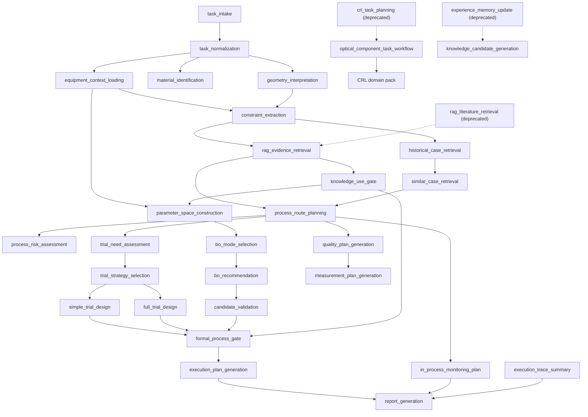

# Skill dependency graph

Skills orchestrate business decisions; low-level persistence, hashing, FTS/vector access, file copying, unit conversion, and threshold calculations remain services/tools.

## Service/tool boundary

The following are not Skills: SQLite reads/writes, FTS/vector query mechanics, SHA256, equipment configuration loading, unit conversion, threshold comparison, PDF extraction, file copying, and CSV writing. Contracts can call application services that encapsulate those operations, but cannot list `sqlite`, `database_connection`, or `raw_sql` as allowed tools.
