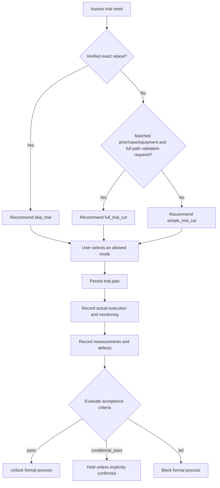

# Dual-mode trial workflow

Implementation paths:

- Pure policy: `ultrafast_domain.trial`
- Persistence: `ultrafast_integrations.storage.trial_repository`
- Application service: `ultrafast_memory.trial.service`
- Versioned schema: migration `0002_trial_workflow`

## Modes

| Mode | Purpose | Representative geometry |
|---|---|---|
| `skip_trial` | Exact repeat within a complete qualified record and unchanged equipment revision | None |
| `simple_trial_cut` | Minimum material/time validation of removal, stability, quality, thermal damage, cracks/chipping, and parameter scale | Process/domain-specific line, patch, hole/3×3 array, or shallow CRL paraboloid |
| `full_trial_cut` | Full geometry, path, layer/zone logic, monitoring, measurement, and accumulated-error validation | Complete target geometry and toolpath |

Skip is not an unrestricted user override. It is allowed only when the task is an exact repeat, the qualified record is complete, equipment revision is unchanged, and the user explicitly permits skipping.

## Decision flow

## Plan contract

Every plan contains:

- Representative geometry with source (`domain_pack` or process rule).
- A five-point bounded parameter matrix derived only from machine bounds (nine points for full trials).
- Measurement plan and traceability requirement.
- Explicit numeric acceptance criteria only when provided by task targets.
- Domain-pack metrics as non-fabricated measurement requirements.
- Stop conditions for energy drift, depth deviation, temperature anomaly, crack growth, chipping, monitoring anomaly, equipment alarm, and processing-time anomaly.

No threshold is invented: absent task/equipment thresholds remain operator/equipment-interlock conditions.

## Persistence and atomicity

`trial_plan`, `trial_execution`, `trial_result`, and `formal_process_decision` are created by an idempotent migration. Plan/execution/result status changes are committed atomically through `UnitOfWork`.

Trial results do not enter `bo_training_sample`. A separate result-quality and BO dataset validation path is required.

## API

- `POST /tasks/{task_id}/trial/assess`
- `POST /tasks/{task_id}/trial/select`
- `POST /tasks/{task_id}/trial/plans`
- `GET /trial/plans/{trial_plan_id}`
- `POST /trial/plans/{trial_plan_id}/executions`
- `POST /trial/executions/{execution_id}/results`
- `POST /trial/results/{result_id}/evaluate`

Tests cover simple/full/skip selection, CRL/TGV representative geometry, parameter matrices, stop conditions, all three evaluation outcomes, formal-process unlock, and non-insertion into BO data.
