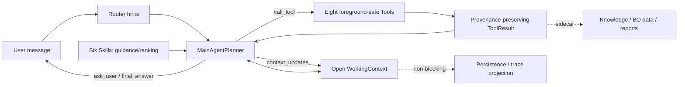

# Current Agent control flow

The Main LLM is the only foreground business orchestrator. Router output and six Skills are non-binding hints; all eight foreground-safe Tools remain discoverable.

Normal termination is semantic, not step-count based. Duplicate Tool calls reuse the existing Observation and replan; repeated no-progress triggers `probable_agent_loop`. An internal 30-decision emergency breaker exists only for program runaway protection.

True blocking guards are limited to equipment physical safety, explicit unsafe conditions, one-time confirmation for actual trial/formal start, and governance approval. BO dataset eligibility never blocks the current machining task.
