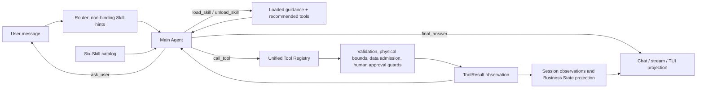

# Current Agent control flow

The main LLM owns planning. Skills provide loadable guidance, tools perform validated effects, and Business State is a projection for display/audit only.

## Persistence

Session persistence exposes `active_skills_json`, `agent_observations_json`, `agent_step_count`, and `last_agent_action_json`. These are stored inside the existing session JSON column to avoid a parallel state database. The renderer also exposes `discoverable_tools` and recent public observations.

## Remaining true guards

- physical equipment bounds;
- required action context and input schemas;
- BO data eligibility;
- human approval for external knowledge bootstrap and knowledge review;
- human approval for trial execution/evaluation;
- prohibited-tool and permission-level enforcement.

There is no mandatory scene workflow and no Business-State-derived action allowlist.
