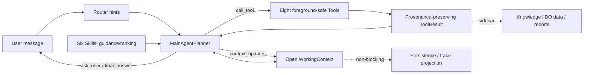

# Current Agent control flow

The Main LLM is the only foreground business orchestrator. Router output and six Skills are non-binding hints; all eight foreground-safe Tools remain discoverable.

The TUI and chat API recognize an explicitly pasted local requirement-document path. Text is extracted from supported text/PDF/DOCX formats and placed directly in the Planner message; Working Context stores only document metadata and provenance. `ask_user` is reserved for genuinely blocking ambiguity and contains only the minimum necessary questions; a single question is valid.

`ProcessPlan` and `TrialPlan` are open semantic structures. They require the Main Agent to express objective, task-relevant strategy, selected variables, evaluation, provenance, risk, and adaptation logic, but they do not prescribe drilling, cutting, texturing, film-removal, polishing, or optical-surface-specific fields. Concrete operations and metrics are selected from the current task and loaded Skill method.

Normal termination is semantic, not step-count based. Duplicate Tool calls reuse the existing Observation and replan; repeated no-progress triggers `probable_agent_loop`. An internal 30-decision emergency breaker exists only for program runaway protection.

True blocking guards are limited to equipment physical safety, explicit unsafe conditions, one-time confirmation for actual trial/formal start, and governance approval. BO dataset eligibility never blocks the current machining task.
