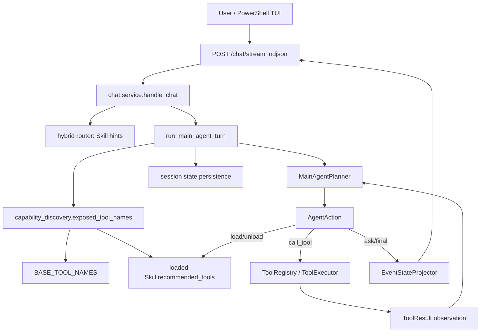

# Foreground runtime before convergence

Inventory baseline: `2eb96daffed25be8c355004133048a108a4ca800` on `main`, clean worktree, runtime mode `capability_discovery`, backend PID `22760`.

## Runtime identity

| Component | Runtime path |
|---|---|
| Main loop | `src/ultrafast_memory/agent_runtime/main_agent_loop.py` |
| Planner | `src/ultrafast_memory/agent_runtime/planner.py` |
| Skill registry | `src/ultrafast_memory/agent_runtime/skill_registry.py` |
| Tool registry | `src/ultrafast_memory/agent_runtime/tool_registry.py` |
| Task-context write Tool | `src/ultrafast_agent/task_intake/update_task_context_tool.py` |

## Active foreground call graph

The NDJSON wrapper already uses a worker thread and event callback, so planning and Tool events are emitted before loop completion. A three-second heartbeat is active. The Planner already performs two real structured-output attempts; the first exception does not return early. The old fixed eight-decision normal termination was already removed before this inventory.

## Agent-facing Tools before convergence

| Tool | Visibility before convergence | Boundary |
|---|---|---|
| `update_task_context` | base / always visible | blocking session write |
| `get_equipment_context` | base / always visible | read-only, equipment-revision cache |
| `search_knowledge` | only through loaded Skill | read-only, per-turn cache |
| `recommend_parameters_bo` | only through loaded Skill | read-only calculation |
| `recommend_parameters_rag` | only through loaded Skill | read-only retrieval |
| `propose_exploratory_parameters` | only through loaded Skill | read-only hypothesis |
| `manage_trial` | only through loaded Skill | domain write |
| `run_bo_iteration` | only through loaded Skill | read-only calculation wrapper |
| `record_process_result` | only through loaded Skill | session write |
| `create_knowledge_candidate` | only through loaded Skill | governance-side write exposed to foreground |
| `generate_report` | only through loaded Skill | post-process write exposed to foreground |
| `bootstrap_external_knowledge` | only through loaded Skill | external/governance approval |
| `ingest_files` | only through loaded Skill | artifact write |
| `review_knowledge_candidate` | only through loaded Skill | governance approval |

`capability_discovery.exposed_tool_names()` is an implicit Tool whitelist: base Tools plus `recommended_tools` of loaded Skills. Therefore Skills still control existence, not only ranking.

## Skill registry before convergence

Exactly six Skills are registered: `task_understanding`, `evidence_research`, `process_planning`, `parameter_recommendation`, `experiment_optimization`, and `result_learning`. No scene-specific Skill is present.

## Controls still in the foreground path

- `update_task_context` is a mandatory Agent action for natural-language facts. It synchronously normalizes, validates, merges, writes provenance/revisions, and persists the session.
- `AgentAction` has no `context_updates`; there is no in-memory open-world Working Context contract.
- `main_agent_loop` passes `human_approved=False` to every Tool execution.
- `BusinessStateController.ensure/transition` is called by the Main loop even though Business State is intended as a projection.
- Tool contracts use strict legacy paths such as `task_spec.material` and `task_spec.process_type`.
- Context schema still includes scenario-specific top-level fields for cutting and drilling.
- Exact repeated actions are stopped, but there is no internal emergency breaker or observation-reinjection contract.
- Persistence, trace writes, result recording, report generation, and knowledge-candidate creation can raise into the foreground loop.

## Parallel active control surfaces

The API router list still exposes `/workflows/{workflow_name}`, `/process-workflow/*`, `/tasks/*/trial/*`, and `/api/v1/trial-campaigns/*` alongside `/chat`. `TaskWorkflowService` executes fixed `WorkflowDefinition` graphs. These paths are not called by `/chat`, but they remain active normal APIs and constitute additional business control surfaces.

