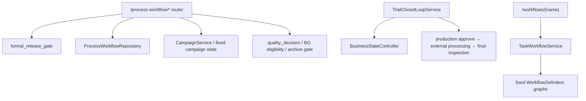

# Formal-process runtime before convergence

Inventory baseline: `2eb96daffed25be8c355004133048a108a4ca800`.

## Active formal-process surfaces

The `/process-workflow/*` router is registered in the application and directly exposes release, preflight, start, progress, checkpoint, pause/resume/abort/finish, inspection, rework, result validation, experiment record, BO eligibility, knowledge candidate, report, and archive endpoints. None is reachable through the Main Agent Tool Registry.

## Formal execution model before convergence

- Release is gated by trial pass, allowed source types, equipment revision, and preflight.
- Start requires a preflight-passed stored plan.
- Checkpoint behavior is hard-coded from numeric `deviation_level`: continue, pause, or abort/return-to-trial.
- Finished executions expose only `submit_final_inspection` as the next required action.
- Quality evaluation in `process_workflow.closure` returns `inconclusive` for missing metrics, but `TrialClosedLoopService._quality_decision` returns `FAIL` for missing measurements or target values.
- `TrialClosedLoopService` transitions formal processing through `BusinessStateController` and synchronously generates a report on PASS.
- `ProcessStateMachine` is a compatibility alias for `LegacyProcessStateAdapter`, with a linear `ALLOWED` transition graph and a calculated percentage.
- `TaskWorkflowService` and `ultrafast_agent.workflows.formal` retain mandatory scene workflows (`complex_process_task`, optical component, microhole array).

## Callers of old Workflow/FSM code

| Surface | Runtime callers before convergence |
|---|---|
| `TaskWorkflowService` | `/workflows/*` router only |
| `get_workflow` / formal `WORKFLOWS` | `TaskWorkflowService` only |
| `LegacyProcessStateAdapter` / `ProcessStateMachine` | process-workflow tests and compatibility imports; not `/chat` |
| `BusinessStateController` | MainAgentLoop projection updates and `TrialClosedLoopService` transitions |
| `CampaignService` | process-workflow router and debug views |
| `TrialClosedLoopService` formal methods | trial-campaign router only |
| formal-process repository operations | process-workflow router only |

## Required convergence

Formal processing must enter MainAgentLoop through one `manage_process` capability with `prepare`, `start`, `record_checkpoint`, `record_result`, `complete`, and `abort`. Scoped user approval must guard only `start`. Checkpoint observations must return to the Planner without a fixed next action. Incomplete measurements must be `INCOMPLETE_DATA`/`NEEDS_REVIEW`, and governance/post-process failures must become warnings after the user-facing task result.

