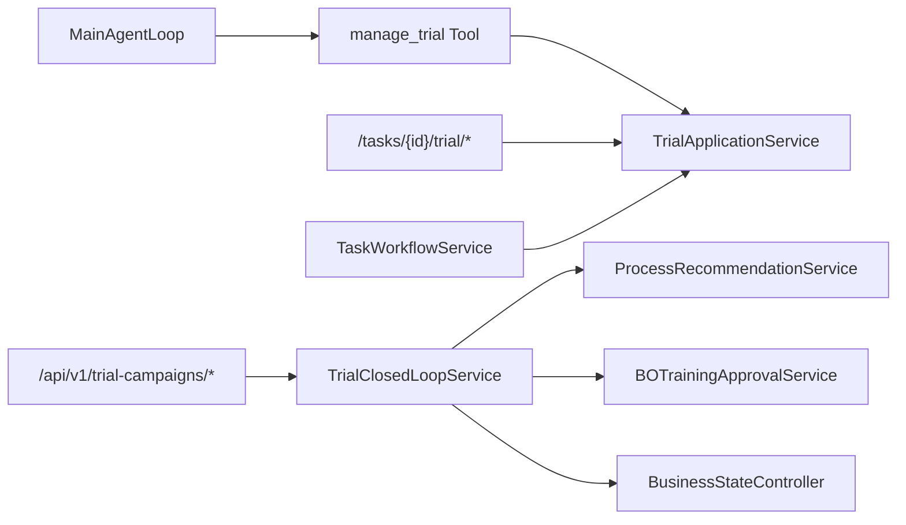

# Trial runtime before convergence

Inventory baseline: `2eb96daffed25be8c355004133048a108a4ca800`.

## Two active Trial implementations

### `TrialApplicationService`

Called by the Agent-facing `manage_trial`, the `/tasks/{task_id}/trial/*` API, and fixed `TaskWorkflowService`. It owns assessment, mode selection, plan creation/read, execution creation, result creation, and result evaluation through `TrialRepository`.

The current Agent Tool exposes operations `assess`, `create_plan`, `get_plan`, `start_execution`, `create_result`, and `evaluate`. Both `start_execution` and `evaluate` are rejected unless the Tool execution context has `human_approved=True`; the Main loop always supplies `False`.

### `TrialClosedLoopService`

Called by `/api/v1/trial-campaigns/*` and exported by `ultrafast_memory.trial.__init__`. It owns a second campaign/iteration/observation model through `TrialCampaignRepository`.

Its control behavior before convergence includes:

- fixed source selection order `BO → approved prior → RAG → LLM fallback`;
- strategy-owned `iteration_budget`;
- BO eligibility changes campaign substatus to approval pending or feedback rejected;
- ineligible observations cannot advance;
- `CONTINUE_TRIAL` requires `next_bo_result`;
- deterministic `TrialDecisionService` chooses continuation/success/block based on iteration budget;
- `BusinessStateController` enforces transitions;
- production approval, external-processing report, final inspection, quality transition, and report generation are part of the same service.

## Agent visibility before convergence

Only `TrialApplicationService` is reachable from MainAgentLoop, through `manage_trial`. `TrialClosedLoopService` is a parallel HTTP/FSM path, not a capability used by the Main Agent. Continuing a closed-loop campaign is therefore impossible without its dedicated API and BO result.

## Governance coupling before convergence

BO eligibility correctly protects dataset admission, but `approve_feedback_and_advance` also uses eligibility as a trial-continuation gate. Dataset approval and user-task continuation are coupled. Report generation happens synchronously in final inspection. These are foreground blockers rather than side effects.

## Required convergence

One Agent-facing `manage_trial` must remain. It must accept create/get/record/evaluate/close-style operations, evaluate without approval, require scoped approval only for real execution start, return eligibility as an observation rather than a continuation gate, and let MainAgentLoop choose BO, RAG, history, exploration, or user adjustment for the next candidate.

